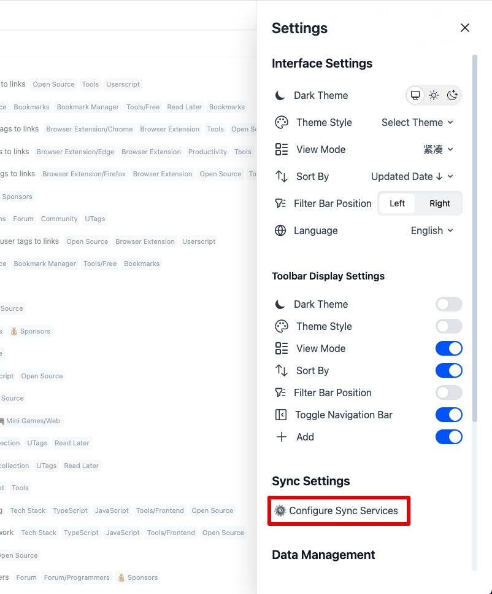

# GitHub 同步配置指南

本文档将指导您如何配置 UTags 与 GitHub 的同步功能，实现书签数据的云端备份和多设备同步。

## 概述

UTags 支持通过 GitHub 仓库来同步您的书签数据。这种方式具有以下优势：

- **免费且可靠**：利用 GitHub 的免费私有仓库存储
- **版本控制**：自动记录书签变更历史
- **多设备同步**：在不同设备间保持书签数据一致
- **数据安全**：您完全控制自己的数据

## 前置要求

- GitHub 账户
- UTags 应用程序
- 网络连接

## 步骤一：创建 GitHub 仓库

1. 登录您的 GitHub 账户
2. 点击右上角的 "+" 按钮，选择 "New repository"
3. 填写仓库信息：
   - **Repository name**：建议使用 `utags-bookmarks-data` 或类似名称
   - **Description**：可选，例如 "UTags bookmarks sync repository"
   - **Visibility**：选择 "Private"（**推荐**）或 "Public"
4. 勾选 "Add a README file"
5. 点击 "Create repository"

## 步骤二：获取 GitHub Personal Access Token

GitHub 提供两种类型的 Personal Access Token：

- **Classic tokens**：传统的 Token 类型，权限范围较广
- **Fine-grained personal access tokens**：新的 Token 类型，提供更精细的权限控制（推荐）

### 方法一：创建 Fine-grained Personal Access Token（推荐）

#### 2.1.1 生成 Fine-grained Token

1. 在 GitHub 中，点击右上角头像，选择 "Settings"
2. 在左侧菜单中找到 "Developer settings"
3. 点击 "Personal access tokens" → "[Fine-grained tokens](https://github.com/settings/personal-access-tokens)"
4. 点击 "Generate new token"

#### 2.1.2 配置 Fine-grained Token

在 Token 配置页面中：

1. **Token name**：填写描述，例如 "UTags Sync Token"
2. **Expiration**：选择过期时间（建议选择 1 年或自定义时间）
3. **Resource owner**：选择您的 GitHub 账户
4. **Repository access**：
   - 选择 "Only Select repositories"
   - 选择您在步骤一中创建的 `utags-bookmarks-data` 仓库

5. **Permissions**：在 "Repository permissions" 部分，设置以下权限：
   - **Contents**: Read and write（读写仓库内容）
   - **Metadata**: Read（读取仓库元数据）

6. 点击 "Generate token"

#### 2.1.3 保存 Fine-grained Token

⚠️ **重要提醒**：Token 只会显示一次，请立即复制并妥善保存！

### 方法二：创建 Classic Personal Access Token

如果您更熟悉传统的 Token 方式，也可以使用 Classic Token：

#### 2.2.1 生成 Classic Token

1. 在 GitHub 中，点击右上角头像，选择 "Settings"
2. 在左侧菜单中找到 "Developer settings"
3. 点击 "Personal access tokens" → "[Tokens (classic)](https://github.com/settings/tokens)"
4. 点击 "Generate new token" → "Generate new token (classic)"

#### 2.2.2 配置 Classic Token 权限

在 Token 配置页面中：

1. **Note**：填写描述，例如 "UTags Sync Token"
2. **Expiration**：选择过期时间（选择适当的过期时间，例如 1 年或 "No expiration"）
3. **Select scopes**：勾选以下权限：
   - `repo`（完整仓库访问权限）
   - 或者仅勾选 `public_repo`（如果使用公开仓库）

4. 点击 "Generate token"

#### 2.2.3 保存 Classic Token

⚠️ **重要提醒**：Token 只会显示一次，请立即复制并妥善保存！

### 两种 Token 类型的对比

| 特性       | Fine-grained Token   | Classic Token    |
| ---------- | -------------------- | ---------------- |
| 权限精度   | 精细到具体仓库和操作 | 较为宽泛         |
| 安全性     | 更高，最小权限原则   | 较低，权限范围大 |
| 配置复杂度 | 稍复杂               | 简单             |
| 推荐程度   | 推荐                 | 适合快速配置     |

**建议**：如果您注重安全性和权限控制，推荐使用 Fine-grained Token；如果您希望快速配置，可以使用 Classic Token。

## 步骤三：在 UTags 中配置同步

### 3.1 打开同步设置

1. 打开 [UTags 应用](https://utags.link/)
2. 进入设置界面
3. 找到 "同步设置" 或 "Sync Settings" 选项

### 3.2 配置 GitHub 同步

在同步设置中填写以下信息：

1. **Service Name**：填写任意名称
2. **同步方式**：选择 "GitHub"
3. **仓库名称**：您的 GitHub 用户名 + "/" + 步骤一中创建的仓库名（例如：`utags-bookmarks-data`）
4. **Access Token**：粘贴步骤二中获取的 Personal Access Token
5. **分支名称**：通常使用 `main`（默认分支）

### 3.3 测试连接

1. 点击 "测试连接" 按钮
2. 如果配置正确，应该显示连接成功的提示
3. 如果连接失败，请检查：
   - Token 是否正确
   - 仓库名称是否准确
   - 网络连接是否正常

## 步骤四：执行首次同步

### 4.1 选择同步方向

首次同步时，您需要选择数据同步方向：

- **合并同步**：智能合并本地和远程数据 (默认)
- **上传到 GitHub**：将本地书签上传到 GitHub 仓库
- **从 GitHub 下载**：从 GitHub 仓库下载书签到本地

### 4.2 开始同步

1. 选择合适的同步方向
2. 点击 "开始同步" 按钮
3. 等待同步完成

## 日常使用

### 自动同步

配置完成后，UTags 将自动在以下情况下进行同步：

- 应用启动时
- 书签数据发生变更时
- 定期自动同步（可在设置中配置间隔）

### 手动同步

您也可以随时手动触发同步：

1. 进入同步设置页面
2. 点击 "立即同步" 按钮

### 同步状态查看

在同步设置页面中，您可以查看：

- 最后同步时间
- 同步状态（成功/失败/进行中）
- 同步日志（_此功能未来将会添加_）

## 多设备同步

要在多个设备间同步书签：

1. 在每个设备上打开 [UTags 应用](https://utags.link/)
2. 使用相同的 GitHub 仓库配置同步
3. 确保所有设备都能正常连接到 GitHub

### 冲突处理

当多个设备同时修改书签时，可能出现冲突：

- UTags 会尝试自动合并变更
- 如果无法自动合并，会提示您手动解决冲突
- 建议在一个设备上完成大量编辑后，等待同步完成再在其他设备上操作

## 故障排除

### 常见问题

#### 1. Token 权限不足

**错误信息**："403 Forbidden" 或 "权限不足"

**解决方案**：

- 检查 Token 是否包含 `repo` 权限
- 确认 Token 未过期
- 重新生成 Token 并更新配置

#### 2. 仓库不存在

**错误信息**："404 Not Found" 或 "仓库不存在"

**解决方案**：

- 确认仓库名称拼写正确
- 检查仓库是否为私有（需要相应权限）
- 确认用户名正确

#### 3. 网络连接问题

**错误信息**："网络超时" 或 "连接失败"

**解决方案**：

- 检查网络连接
- 确认防火墙设置
- 尝试使用代理（如果需要）

#### 4. 同步冲突

**错误信息**："同步冲突" 或 "合并失败"

**解决方案**：

- 查看冲突详情
- 选择保留本地或远程版本
- 手动合并冲突的书签

### 日志查看（_此功能未来将会添加_）

如果遇到问题，可以查看详细日志：

1. 进入 UTags 设置
2. 找到 "日志" 或 "Logs" 选项
3. 查看同步相关的错误信息

## 安全注意事项

1. **Token 安全**：

   - 不要将 Token 分享给他人
   - 定期更换 Token
   - 如果 Token 泄露，立即在 GitHub 中撤销

2. **数据隐私**：

   - 建议使用私有仓库存储敏感书签
   - 定期检查仓库访问权限

3. **备份策略**：
   - GitHub 同步不能替代本地备份
   - 建议定期导出书签数据作为额外备份

## 高级配置

### 自定义同步频率

在设置中可以配置：

- 自动同步间隔（分钟）
- 是否在应用启动时同步
- 是否在数据变更时立即同步

### 同步过滤（_此功能未来将会添加_）

您可以设置哪些数据需要同步：

- 书签数据
- 标签信息
- 分类结构
- 应用设置

### 分支管理

对于高级用户，可以使用不同分支管理不同设备的数据：

- 为每个设备创建独立分支
- 定期合并到主分支
- 实现更精细的版本控制

## 与其他同步方式的对比

| 特性         | WebDAV | GitHub | UTags 官方云存储 |
| ------------ | ------ | ------ | ---------------- |
| 配置复杂度   | 简单   | 中等   | 简单             |
| 技术门槛     | 低     | 中等   | 低               |
| 版本控制     | 基础   | 完整   | 完整             |
| 访问速度     | 快     | 中等   | 快               |
| 存储成本     | 低     | 免费   | 中等             |
| 隐私控制     | 高     | 中等   | 高               |
| 跨平台支持   | 优秀   | 优秀   | 优秀             |
| 数据同步方式 | 全量   | 全量   | 全量或增量       |
| 增量变更同步 | 不支持 | 不支持 | 支持             |
| 数据加密     | 不支持 | 不支持 | 支持             |

## 总结

通过以上步骤，您已经成功配置了 UTags 与 GitHub 的同步功能。这将确保您的书签数据安全地存储在云端，并能在多个设备间保持同步。

如果在使用过程中遇到任何问题，请参考故障排除部分，或查看 UTags 的官方文档和社区支持。
