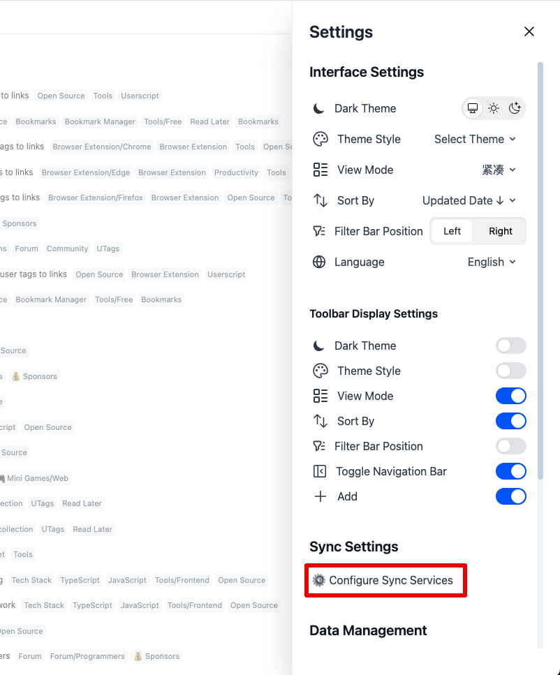
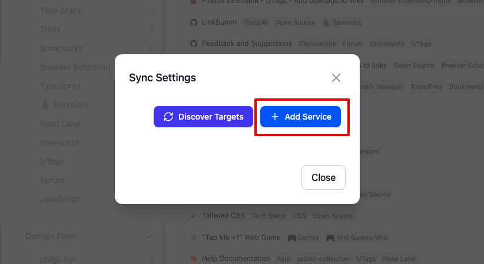
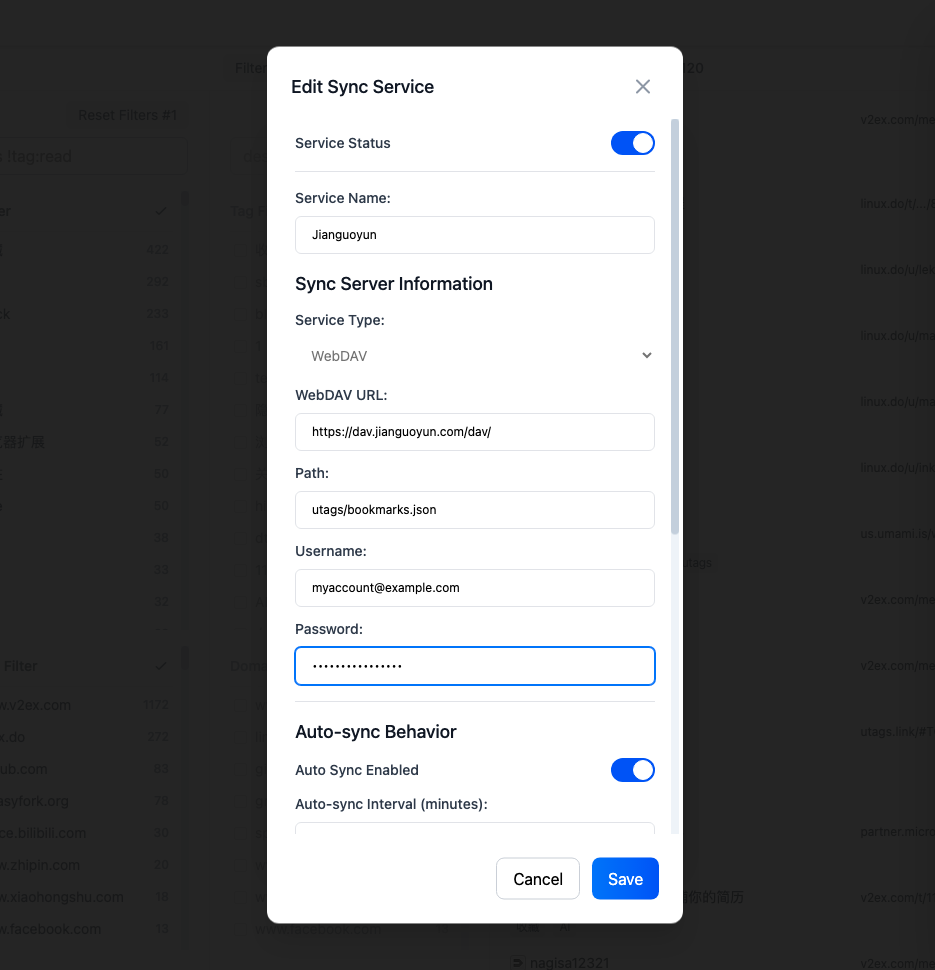
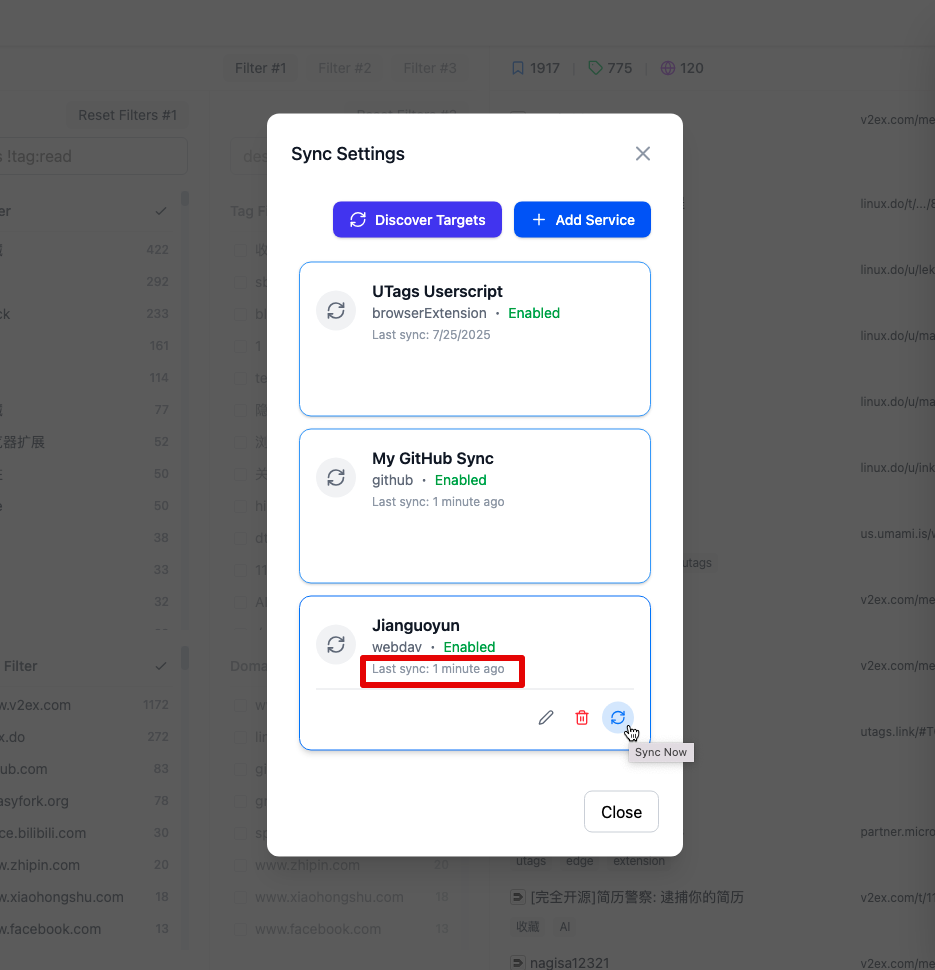

# WebDAV 同步配置指南

本文档将指导您如何配置 UTags 与 WebDAV 服务的同步功能，实现书签数据的云端备份和多设备同步。

## 概述

UTags 支持通过 WebDAV 协议来同步您的书签数据。WebDAV（Web Distributed Authoring and Versioning）是一种基于 HTTP 的协议，允许用户在远程服务器上存储和管理文件。这种方式具有以下优势：

- **广泛兼容**：支持多种云存储服务（坚果云、Nextcloud 等）
- **标准协议**：基于开放标准，兼容性好
- **自主控制**：可以使用自建服务器，完全控制数据
- **简单配置**：只需要服务器地址和认证信息
- **跨平台**：支持各种操作系统和设备

## 前置要求

- 支持 WebDAV 的云存储服务账户或自建 WebDAV 服务器
- UTags 应用程序
- UTags 浏览器扩展或用户脚本
- 网络连接

## 支持的 WebDAV 服务

### 推荐的云存储服务

1. **坚果云**

   - 国内访问速度快
   - 免费版提供 1GB 上传流量/月
   - 官方支持 WebDAV

2. **Nextcloud**

   - 开源自建云存储解决方案
   - 功能丰富，支持多种扩展
   - 完全自主控制

## 步骤一：准备 WebDAV 服务

### 方法一：使用坚果云（推荐）

#### 1.1 注册坚果云账户

1. 访问 [坚果云官网](https://www.jianguoyun.com/)
2. 注册新账户或登录现有账户
3. 完成邮箱验证

#### 1.2 开启 WebDAV 功能

1. 登录坚果云网页版
2. 点击右上角头像，选择 "账户信息"
3. 在左侧菜单中选择 "安全选项"
4. 找到 "第三方应用管理" 部分
5. 点击 "添加应用" 或 "生成密码"

#### 1.3 获取 WebDAV 信息

配置完成后，您将获得：

- **服务器地址**：`https://dav.jianguoyun.com/dav/`
- **用户名**：您的坚果云邮箱地址
- **密码**：生成的应用专用密码（不是登录密码）

### 方法二：使用 Nextcloud

#### 2.1 获取 Nextcloud 访问权限

如果您有 Nextcloud 服务器访问权限：

1. 登录您的 Nextcloud 实例
2. 点击右上角头像，选择 "设置"
3. 在左侧菜单中选择 "安全"
4. 在 "应用专用密码" 部分生成新密码

#### 2.2 获取 WebDAV 信息

- **服务器地址**：`https://your-nextcloud-domain.com/remote.php/dav/files/USERNAME/`
- **用户名**：您的 Nextcloud 用户名
- **密码**：生成的应用专用密码

### 方法三：自建 WebDAV 服务器

如果您有技术能力，可以自建 WebDAV 服务器：

1. 使用 Apache/Nginx 配置 WebDAV 模块
2. 或使用专门的 WebDAV 服务器软件（如 SabreDAV）
3. 配置 HTTPS 和身份验证
4. 确保防火墙允许相应端口访问

## 步骤二：在 UTags 中配置 WebDAV 同步

### 2.1 打开同步设置

1. 打开 [UTags 应用](https://utags.link/)
2. 进入设置界面
3. 找到 "同步设置" 或 "Sync Settings" 选项
4. 点击 "添加同步服务"

### 2.2 配置 WebDAV 同步

在同步设置中填写以下信息：

1. **Service Name**：填写任意名称（例如："坚果云同步"）
2. **同步方式**：选择 "WebDAV"
3. **服务器地址**：填写 WebDAV 服务器 URL
   - 坚果云：`https://dav.jianguoyun.com/dav/`
   - Nextcloud：`https://your-domain.com/remote.php/dav/files/username/`
4. **用户名**：您的服务账户用户名
5. **密码**：应用专用密码或账户密码
6. **远程路径**：可选，指定存储路径（例如：`utags/bookmarks.json`）

### 2.3 高级设置（可选）

根据需要配置以下高级选项：

- **同步间隔**：设置自动同步频率，默认 15 分钟
- **同步方向**：选择 **合并同步** 或 "上传到服务器" 或 "从服务器下载"

### 2.4 测试连接

1. 填写完所有必要信息后，点击 "测试连接" 按钮
2. 如果配置正确，应该显示连接成功的提示
3. 如果连接失败，请检查：
   - 服务器地址是否正确
   - 用户名和密码是否准确
   - 网络连接是否正常
   - 防火墙是否阻止连接

![WebDAV 连接测试截图占位符]

## 步骤三：执行首次同步

### 3.1 选择同步方向

首次同步时，您需要选择数据同步方向：

- **合并同步**：智能合并本地和远程数据（默认推荐）
- **上传到服务器**：将本地书签上传到 WebDAV 服务器
- **从服务器下载**：从 WebDAV 服务器下载书签到本地

### 3.2 开始同步

1. 选择合适的同步方向
2. 点击 "开始同步" 按钮
3. 等待同步完成
4. 查看同步结果和日志

## 日常使用

### 自动同步

配置完成后，UTags 将自动在以下情况下进行同步：

- 应用启动时
- 书签数据发生变更时
- 定期自动同步（可在设置中配置间隔）

### 手动同步

您也可以随时手动触发同步：

1. 进入同步设置页面
2. 选择对应的 WebDAV 服务
3. 点击 "立即同步" 按钮

### 同步状态查看

在同步设置页面中，您可以查看：

- 最后同步时间
- 同步状态（成功/失败/进行中）
- 数据传输量
- 错误信息（如有）

## 多设备同步

要在多个设备间同步书签：

1. 在每个设备上打开 [UTags 应用](https://utags.link/)
2. 使用相同的 WebDAV 服务器配置同步
3. 确保所有设备都能正常连接到 WebDAV 服务器
4. 建议在不同设备上使用相同的远程路径

### 冲突处理

当多个设备同时修改书签时，可能出现冲突：

- UTags 会尝试自动合并变更
- 如果无法自动合并，会提示您手动解决冲突
- 系统会保留冲突文件的备份版本
- 建议在一个设备上完成大量编辑后，等待同步完成再在其他设备上操作

## 故障排除

### 常见问题

#### 1. 连接超时或失败

**错误信息**："连接超时" 或 "无法连接到服务器"

**解决方案**：

- 检查网络连接是否正常
- 确认服务器地址拼写正确
- 检查防火墙设置
- 尝试增加连接超时时间
- 确认 WebDAV 服务是否正常运行
- 确认是否安装并启用了 UTags 浏览器扩展或用户脚本

#### 2. 身份验证失败

**错误信息**："401 Unauthorized" 或 "身份验证失败"

**解决方案**：

- 确认用户名和密码正确
- 检查是否需要使用应用专用密码
- 确认账户是否已启用 WebDAV 功能
- 检查账户是否被锁定或过期

#### 3. 权限不足

**错误信息**："403 Forbidden" 或 "权限不足"

**解决方案**：

- 确认账户有读写权限
- 检查远程路径是否存在且可访问
- 确认存储空间是否充足
- 联系服务提供商检查权限设置

#### 4. SSL/TLS 证书问题

**错误信息**："SSL 证书验证失败" 或 "证书不受信任"

**解决方案**：

- 确认服务器使用有效的 SSL 证书
- 如使用自签名证书，可临时关闭证书验证
- 更新系统的根证书库
- 联系服务提供商解决证书问题

#### 5. 同步冲突

**错误信息**："同步冲突" 或 "文件版本冲突"

**解决方案**：

- 查看冲突详情和备份文件
- 选择保留本地或远程版本
- 手动合并冲突的书签数据
- 确保设备间的时间同步正确

### 性能优化

#### 提高同步速度

1. **选择就近的服务器**：使用地理位置较近的 WebDAV 服务器
2. **优化网络连接**：使用稳定的网络连接
3. **调整同步频率**：根据使用习惯调整自动同步间隔
4. **压缩数据**：如果服务器支持，启用数据压缩

#### 减少流量消耗

1. **合理设置同步频率**：避免过于频繁的同步
2. **使用 WiFi**：在移动设备上优先使用 WiFi 进行同步

## 安全注意事项

### 数据安全

1. **使用 HTTPS**：

   - 始终使用 HTTPS 连接确保数据传输安全
   - 避免在不安全的网络环境下同步敏感数据

2. **密码安全**：

   - 使用强密码保护 WebDAV 账户
   - 定期更换密码
   - 使用应用专用密码而非主账户密码

3. **访问控制**：
   - 定期检查账户访问日志
   - 及时撤销不需要的访问权限
   - 使用双因素认证（如果支持）

### 隐私保护

1. **访问权限**：

   - 仅授予必要的读写权限
   - 定期审查文件访问权限

2. **备份策略**：
   - WebDAV 同步不能替代本地备份
   - 建议定期导出书签数据作为额外备份
   - 保留多个版本的备份文件

## 高级配置

### 自定义同步策略

1. **同步频率设置**：

   - 实时同步：数据变更时立即同步
   - 定时同步：按设定间隔自动同步
   - 手动同步：仅在用户触发时同步

2. **冲突解决策略**：
   - 自动合并：智能合并冲突数据
   - 本地优先：冲突时保留本地版本
   - 远程优先：冲突时保留远程版本
   - 手动处理：提示用户手动解决

## 与其他同步方式的对比

| 特性         | WebDAV | GitHub | UTags 官方云存储 |
| ------------ | ------ | ------ | ---------------- |
| 配置复杂度   | 简单   | 中等   | 简单             |
| 技术门槛     | 低     | 中等   | 低               |
| 版本控制     | 基础   | 完整   | 完整             |
| 访问速度     | 快     | 中等   | 快               |
| 存储成本     | 低     | 免费   | 中等             |
| 隐私控制     | 高     | 中等   | 高               |
| 跨平台支持   | 优秀   | 优秀   | 优秀             |
| 数据同步方式 | 全量   | 全量   | 全量或增量       |
| 增量变更同步 | 不支持 | 不支持 | 支持             |
| 数据加密     | 不支持 | 不支持 | 支持             |

## 总结

通过以上步骤，您已经成功配置了 UTags 与 WebDAV 服务的同步功能。WebDAV 同步具有配置简单、兼容性好、访问速度快等优势，是一个很好的书签同步解决方案。

### 最佳实践建议

1. **选择可靠的服务提供商**：推荐使用坚果云等稳定的服务
2. **定期备份数据**：不要完全依赖云同步，保持本地备份习惯
3. **监控同步状态**：定期检查同步是否正常工作
4. **保护账户安全**：使用强密码和应用专用密码
5. **合理设置同步频率**：根据使用习惯调整同步策略

如果在使用过程中遇到任何问题，请参考故障排除部分，或查看 UTags 的官方文档和社区支持。
